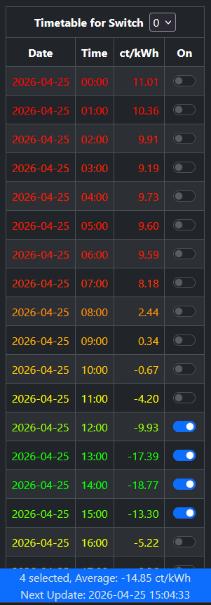
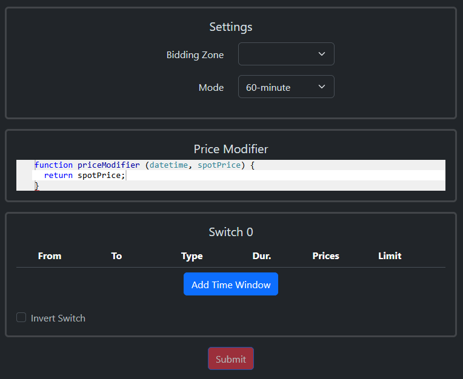

# Spot-Price Based Control of Shelly Devices

## Introduction

This script uses EPEX spot energy prices to control the power output of a Shelly device. It runs
directly on the Shelly and the only technical requirement is that the Shelly has access to the
internet. The script should run on all Gen2+ Shelly switches.

The core concept is as follows:

- You define one or more time windows for the day (a time window could for example start at 7:00 and
  end at 19:00)
- For each time window, you define for how long the output should be active (for example 4 hours)
- Every day at 15:00, the script downloads the EPEX prices for the next day, finds the cheapest
  hours according to your setup and schedules power on commands for them (in this example, for the
  4 cheapest hours between 7:00 and 19:00)

The calculated results can then be reviewed and modified in the timetable UI that is provided by
the script:

<p align="center">
  
</p>

Additional features:

- The script comes with its own configuration UI to make setup as easy as possible.
- You can set the script to work with either 60-minute or 15-minute prices to match the conditions
  of your contract.
- For Shelly devices with multiple switches, separate calculation rules can be defined for each
  switch.
- Instead of looking for the lowest prices, you can also define time windows that search for the
  highest prices in a time window (for example to activate the output of a battery when prices
  are high).
- You can set time windows with hard price limits to activate power only if the price is below (or
  above) a certain cent/kWh threshold.
- You can include date- or time-dependent price components like variable grid fees in the
  calculation by defining your own price modification routine.
- If price data cannot be downloaded due to technical issues with the API server, the script
  automatically applies a fallback mode which calculates power output hours based on statistical
  prices.

Note:
The prices are provided by [energy-charts.info](https://energy-charts.info), an organization that
generously offers unrestricted access to their EPEX market price API. The license under which
price data is made available depends on your location - see
[the API documentation](https://api.energy-charts.info/#/prices) for details.

## Installation

Before you start the installation process, make sure that the following prerequisites are fulfilled:

- The firmware version of your Shelly must be at least 1.7.5
- On Shelly Gen3 devices, the available memory for scripts is reduced when Matter is activated. The
  script cannot run with this reduced memory, so make sure to deactivate Matter before installing
  it.

Follow these steps for the installation:

1. Enter the IP Address of your Shelly in the URL field of your browser.
1. Select the `Scripts` Tab.
1. Click on the `Create Script` button.
1. Copy the COMPLETE source code from [this link](./dist/final.js) into the script window.
1. (Optional): Enter a script name in the corresponding field.
1. Click `Save` and `Start`. The script is now running.
1. Go back to the `Scripts` tab and make sure that the text below the script name says
   `Running`.<br>(Also take note of the script number that the Shelly has automatically
   assigned to the script. You will use this number to review information in your browser.)
1. Activate the `Run on startup` switch to make sure that the script restarts after a
   reboot of the device.
1. You can now set up the script by opening the url
   `http://<shelly_ip>/script/<script_id>/config` in your browser (replace the script_id with the
   script number from step 7).

## Configuration

The script will be idle until you have completed and submitted the configuration. To do this, open
`http://<shelly_ip>/script/<script_id>/config` in the browser which will show the configuration
screen:

<p align="center">
  
</p>

## Settings

Define basic script settings in this section.

### Bidding Zone

Select the Bidding Zone that matches your location/contract. This is a required field.

### Mode

Choose the mode that matches your contract. In 60-minute mode, the script calculates with and
displays hourly prices only. In 15-minute mode all calculations are done with quarter-hourly prices.

Note: For technical reasons, changing the mode will remove all time windows that have been defined.

## Price Modifier

By default, the script calculates with and displays EPEX spot prices. There are, however, many
other components on your invoice that are added to this price like fees and taxes. And some of these
components may be variable, for example grid fees that vary by time of day or time of year.

By changing the `priceModifier` function, you can write your own logic that adds your individual
components to the EPEX price and this modified price is then used by the script to determine the
cheapest hours. An example:

A grid operator charges different grid fees depending on the time of day:

- The fee is 10 ct/kWh during the peak hours from 7:00 to 9:00 and 18:00 to 20:00.
- For the remainder of the day, the fee is 8 ct/kWh.

The `priceModifier` function can be modified like so to add these fees to the EPEX price:

```javascript
function priceModifier(datetime, spotPrice) {
  let hour = datetime.getHours(); // extract hour from the datetime
  if (hour === 7 || hour === 8 || hour === 18 || hour === 19) {
    return spotPrice + 10; // peak hour - add 10 cent to the EPEX price
  }
  return spotPrice + 8; // normal hour - add 8 cent to the EPEX price
}
```

The algorithm can be as complex as you need it to be - just make sure that the expression after the
`return` statement(s) always returns a number. The resulting value will be rounded to two decimal
positions when it is displayed on the Web UI.

The maximum length of the code in this function is 1024 bytes - a warning will appear if this
length is exceeded. Do not submit the configuration while this warning is displayed!

Note: Even if you do not use this feature, do not remove the code - it must at least contain the
`return spotPrice` statement.

## Switch Settings

This is the place where you define the time windows and calculation rules. One instance of this
card is displayed for each switch that is present on the device. You can define up to 30 time
windows and you can distribute these windows among the available switches as needed.

Note: the script will only take control of switches that have at least one time window defined.

After clicking the `Add Time Window` button, you can define the following fields for the window:

### From & To

These two fields define the start and end time of the time window. Make sure that the end time is
greater than the start time!

### Type

This sets the calculation method for this time window. Two methods are supported:

If `block` is selected, the script switches on power for the block of `duration` (see below)
consecutive (quarter) hours with the lowest/highest (depending on the `prices` field, see below)
average price within the time window.

If `non-block` is selected, the script switches on power for the cheapest/most expensive
`duration` (quarter) hours within the time window, even if they do not form a contiguous block.

### Duration

- In 60-minute mode, this defines the number of hours within the time window for which power will be
  activated.
- In 15-minute mode, this is the number of quarter hours within the time window for which power will
  be activated.

### Prices

Choose whether you want to activate power for the lowest or highest prices within the time window.

### Limit

In this field, you can set an absolute value in cent/kWh. How this value is applied depends on the
`Prices` selection:

- If the time window is set to search for the lowest prices, this limit defines the **maximum**
  price. E. g. if the value is set to `10`, output will only be activated for (quarter) hours with
  a price less than or equal to 10.
- If the time window is set to search for the highest prices, this limit defines the **minimum**
  price. E. g. if the value is set to `10`, output will only be activated for (quarter) hours with
  a price greater than or equal to 10.

The price limit can have decimals - e. g. a value of `10.5` cent is fine. Independent of your locale,
make sure to always use a decimal POINT, not a decimal COMMA.

### Invert Switch

This checkbox can invert the switching logic for the switch which is useful for some electrical
configurations:

- When unchecked, the script turns the switch ON for the selected (cheapest/costliest) hours and
  OFF for the remaining hours.
- When checked, the script turns the switch OFF for the selected (cheapest/costliest) hours and ON
  for the remaining hours.

## Submitting the Configuration

Once you are done with your setup, click the submit button (the button will be disabled if you do
not have at least one time window defined). The script will now calculate the switch times for the
current day. The process works as follows:

- Once the calculation for the current day is completed, all records that lie before the system
  time are removed (since it does not make sense to show outdated data on the timetable). So while
  the calculation does consider all prices of the day, you will only see a fraction of the results
  on the timetable.
- If the initial calculation takes place after 15:00, the script will also calculate the following
  day immediately.
- If the initial calculation takes place before 15:00, the following day will (as usual) be
  calculated shortly after 15:00.

The calculation results can be reviewed and modified in the timetable view which can be opened
in the browser with the URL `http://<shelly_ip>/script/<script_id>/spotelly`.

Note: On multi-switch devices, the timetable view will show the timetable for switch `0` by default
and you can select a different switch from the dropdown. You can also directly view the timetable
for a specific switch by appending the switch ID to the URL like so:
`http://<shelly_ip>/script/<script_id>/spotelly?id=<switch_id>`

## Extending the Script with Custom Functionality

You can extend the functionality of the script by writing your own code that reacts to script
events. The principle is as follows:

At each full hour or quarter hour (depending on the operating mode that you have set), the script
checks its internal schedule and makes sure that the state of all switches it controls matches this
schedule.

The script emits an event whenever this check occurs. The name of this event is `spotelly_tick` and
it carries the following data:

```javascript
{
  current_price: 10, // price for the current 15/60 minute period (will be NaN in fallback mode)
  next_price: 12,    // price for the next 15/60 minute period (will be NaN in fallback mode)
  // one of the following for each switch that is controlled by the script
  // these are always included, even when the state hasn't changed from the previous period
  switch_0: true,    // switch state for the current 15/60 minute period
  switch_2: false
}
```

You can process these events in your own, separate script - like this one, which just listens for
the event and prints the event data to the console on each trigger:

```javascript
Shelly.addEventHandler(function (event) {
  if (event.name === "script" && event.info && event.info.event === "spotelly_tick") {
    const data = event.info.data;
    console.log("The current price is", data.current_price, "ct/kWh.");
    console.log("The next price will be", data.next_price, "ct/kWh.");
    console.log("Switch 0 is", data.switch_0 ? "ON." : "OFF.");
    console.log("Switch 2 is", data.switch_2 ? "ON." : "OFF.");
  }
});
```

This gives you the ability to cover a wide variety of use cases - you could, for example:

- Propagate switch commands to other Shelly or non-Shelly devices in your network
- Send the current/next price to a virtual component or a display
- Trigger notifications via your preferred service
- Update the Shelly Cloud Live Tariff with the current price
- ...etc

With this approach, your custom additions are cleanly decoupled from the main script and will
continue to work when you update the script to a new version.

## FAQ

### A new version of the script is available. How do I upgrade?

If there are no specific upgrade instructions in the CHANGELOG, use the following steps:

1. Stop the script
1. COMPLETELY replace the code of the script with the new version
1. Save the script
1. Start the script

The script will automatically reload the stored configuration.

### I want to modify the script and/or the HTML endpoint. How do I do that?

In order to reduce RAM usage on the Shelly, a build script is used to compress the HTML
files of the config and timetable UIs and merge these compressed versions into the script source
code. If you want to change the script or the Web UI, you need to use this process as well.

First, make sure that you have `Node.js` installed (any recent version will do). Then, clone the
repository:

```
git clone https://github.com/towiat/spotelly
```

and install the development dependencies with npm (or the package manager of your choice):

```
npm i
```

Now, you can make your changes by repeating the following steps as often as you need:

1. Modify the files in the `src` folder as needed
2. Run `npm run build` to execute the HTML compression and merge
3. Install the merged source file `./dist/final.js` on your Shelly

See the source code in the build script `build.js` for a detailed description of the compression
and merge process.

### I have questions or want to give feedback about the script. Where can I do that?

If you cannot or do not want to open an issue in this repository, you can also visit the Shelly
community forum where I monitor a
[thread](https://community.shelly.cloud/topic/15202-script-price-based-control-of-shelly-devices/)
about the script.
